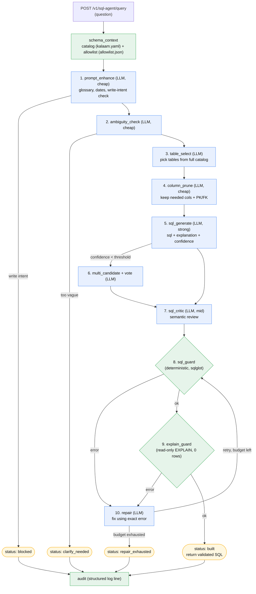

# SQL Builder Agent — Implementation Plan

A natural-language → SQL service. Another internal service POSTs a question; this service returns a
**validated Postgres query string**. It builds SQL only — it never executes the query or returns rows.
Execution and any data-access policy belong to the downstream caller.

## Context / approach

Kalaam is a single Postgres datasource with **68 tables** — small enough to give the model the *entire*
enriched schema directly in-context. A short chain of focused LLM calls turns the question into SQL,
then deterministic (non-LLM) code proves it is safe and runnable. Accuracy comes from the pipeline
stages — semantic critic, confidence-gated multi-candidate generation, deterministic validation, and an
EXPLAIN-driven repair loop — not from any single generation call.

Decisions locked with the user:
- **Orchestration:** plain async service functions. The flow is nearly linear (one confidence branch, one repair loop), so it matches the repo's existing service idiom without extra framework machinery.
- **Model-agnostic:** every LLM call goes through one factory over LangChain `init_chat_model("provider:model")`; the provider/model is chosen per stage by a config string (Anthropic / Google Gemini / OpenAI all work by swapping the string). No provider hard-coded.
- **Schema source:** fed from `kalaam.yaml` in-memory at startup; the guard's column allowlist is a committed JSON snapshot. Audit is a plain structured log line (no database write).
- **EXPLAIN validation:** kept. A read-only, zero-row `EXPLAIN` validates each candidate; its errors feed the repair loop, which corrects the SQL before the final query is produced.
- **PII: generate only.** Sensitive-column flags stay advisory context for the model. The guard does **not** block or warn on sensitive columns in output — the downstream consumer owns that policy.

## How it works — in plain terms

Because Kalaam is only 68 tables, we hand the model the whole enriched schema and let a short chain of
focused LLM calls turn the question into SQL. The core idea: **one giant "here are 68 tables, write the
query" call is exactly where accuracy falls apart** — a model asked to do everything at once picks wrong
tables, invents columns, and botches joins. So instead of one call we make several small ones, each with
a single, narrow job:

1. **Understand the question** — expand jargon/glossary terms, turn "last month" into real dates, and catch anyone trying to make it write data (refused up front).
2. **Decide if it's even answerable** — if the question is too vague to answer safely, stop and ask a clarifying question rather than guessing.
3. **Pick the relevant tables** — from all 68, narrow to the handful the question actually needs.
4. **Prune to relevant columns** — within those tables, keep only the columns that matter (plus the keys needed to join). This keeps the final step focused and cheap.
5. **Generate the SQL** — now, over a small focused slice of the schema, write the query, an explanation, and a self-reported confidence.
6. **Double-check when unsure** — if confidence is low, generate a few alternatives and vote on the best.
7. **Critique the meaning** — a separate call reviews the SQL for logical mistakes a syntax check can't catch: wrong join direction, wrong aggregation, a filter the question implied but the SQL dropped.

Only then does deterministic code take over: a **guard** parses the SQL and proves it's a single safe
read-only query touching only real tables/columns, and an **EXPLAIN** run confirms it would actually
execute. If either finds a problem, the specific error is fed to a **repair** call that fixes it — looping
until the query is clean or a retry budget runs out.

The payoff: each call is small, so a cheap/fast model handles most of them accurately while the few hard
steps get a stronger model — all swappable by config. The deterministic guard means the safety of the
returned SQL never depends on the model "behaving." And nothing is ever executed here — the validated SQL
string is simply returned to whichever service asked for it.

## Scope

**Build (new):** the query-builder pipeline — deterministic SQL guard, model-agnostic LLM factory,
in-memory schema-context loader, the multi-stage generate pipeline (with EXPLAIN-driven repair), a
request/response schema, the `/v1/sql-agent` router, main.py wiring, and an eval/smoke harness.

**Reuse read-only (unchanged):**
- `app/sql_agent/ingestion/loader.py` — parse `kalaam.yaml` into typed models (the semantic catalog).
- `app/sql_agent/ingestion/introspect.py` — read-only *structural* introspection of Kalaam (no data rows), used **offline** by the allowlist-generator script (not at runtime).
- `app/sql_agent/target_db.py` — read-only async engine, used at runtime for EXPLAIN validation (and offline by the allowlist generator).
- `app/sql_agent/workspaces/kalaam.yaml` — the enrichment source of truth.

**Existing modules this build does NOT use (safe to delete in a later cleanup pass):**
- `app/sql_agent/control_db/` — models, `session.py`, `bootstrap.py`, `__init__.py`.
- `app/sql_agent/ingestion/run.py`, `ingestion/diff.py`.
- The `sql_agent_db` database (on turing-postgres) — can be dropped.
- `config.py` fields `sql_agent_control_db_url`, `sql_agent_embedding_model`, `sql_agent_embedding_dim`.
- `pgvector` and `langgraph` in `requirements.txt`.

Nothing in this build imports these. This plan does not delete them — it just doesn't build on them.

**Out of scope (not built):** query execution, result rows, result sanity-checking, PII
redaction/blocking, a propose-then-execute two-phase flow. This is a one-shot query builder.

## Architecture — the pipeline

Natural-language question → **build** (a single call) → returns a validated SQL string + metadata.



*Blue = LLM call · Green = deterministic (no LLM) · Amber = terminal status.*

**Deterministic setup**
- `schema_context` — load once (cached). Produces two things from two sources:
  - **(a) semantic catalog string for prompts** — from `kalaam.yaml` via `ingestion/loader.load_workspace_file`: tables + descriptions + enriched columns + values + glossary + the `instructions` block (sensitive columns included as advisory context).
  - **(b) authoritative `{table: {columns}}` allowlist for the guard** — read from a committed snapshot file `app/sql_agent/workspaces/kalaam.allowlist.json`, generated once from introspection by a small offline script. Covers *every* real column (all ~1,108), not just the enriched subset, so a valid-but-unenriched column is never falsely rejected. Versioned in the repo so the exact set the guard trusts is auditable/diffable; zero DB dependency at runtime for validation. Re-run the generator when the schema changes.

**LLM stages** (each uses its own config model tier; all model-agnostic)
1. `prompt_enhance` (cheap tier) — expand glossary terms, resolve relative dates ("last month"), and **reject write-intent before generation** (fail closed → `blocked`).
2. `ambiguity_check` (cheap tier) — if genuinely underspecified, short-circuit to `clarify` with a question instead of guessing.
3. `table_select` (select tier) — pick the relevant subset from the full injected catalog (structured output).
4. `column_prune` (prune tier) — narrow to needed columns per selected table; **always keep PK/FK columns** for joins.
5. `sql_generate` (generate tier / strongest) — structured `{sql, explanation, tables_used, confidence}`.
6. `multi_candidate + vote` (conditional — only when `confidence < sql_agent_confidence_threshold`) — N candidates (`sql_agent_multi_candidate_count`) via varied framing, LLM-judge/majority pick.
7. `sql_critic` (critic tier) — semantic review distinct from syntax: wrong join direction, wrong aggregation, omitted implied filters, off-by-one date ranges → route to repair.

**Deterministic validation + repair loop**
8. `validate` = `validation/sql_guard.guard_sql` (see Safety below) — static checks.
9. `explain_guard` — **gated by `sql_agent_explain_validation` (default on).** When on, run Postgres `EXPLAIN` over the read-only connection (zero rows fetched); catches runtime-only errors (bad casts, type mismatches, invalid function usage) and absurd cost estimates that the static guard can't → feed error to repair. When off, this step is skipped entirely and the pipeline has **no runtime DB dependency** (static guard only).
10. `repair` (repair tier) — regenerate against the validator's, critic's, or EXPLAIN's specific error; shared budget `sql_agent_max_repair_attempts`; loops back through validate + explain_guard. Budget exhausted → `repair_exhausted` (fail closed, no SQL returned).

**Result** — once validate + EXPLAIN pass clean, return `{sql, explanation, tables_used, confidence, critic_notes, status}`. `audit` (deterministic) emits one structured JSON log line (question, enhanced, selected_tables, final_sql, status, repair_attempts, model_versions). No query executed.

Terminal statuses: `built` (SQL returned), `clarify_needed`, `blocked` (write-intent), `repair_exhausted`.

## API contract (service-facing)

This endpoint is consumed by **other internal services** — its response *is* the SQL. The contract is explicit so callers can act on it programmatically.

**Endpoint:** `POST /v1/sql-agent/query`

**Auth:** mounted under `/v1`, so the deny-by-default `AuthMiddleware` requires a valid `X-API-Key`. Calling services authenticate with a registered service API key. The key is only an **access gate** — the builder is *not* tenant-data-scoped (it always targets the Kalaam schema), so `tenant.client_id` is used for audit attribution/rate accounting, not for filtering.

**Request** (`BuildQueryRequest`): `{ "question": str, "workspace": str = "kalaam" }`.

**Response** (`BuildQueryResponse`, HTTP 200 for every *handled* outcome so callers branch on `status`, not on HTTP errors):
```json
{
  "status": "built | clarify_needed | blocked | repair_exhausted",
  "sql": "SELECT ... LIMIT 200",        // null unless status == built
  "dialect": "postgresql",
  "validated": true,                      // passed static guard + EXPLAIN
  "explanation": "…",
  "tables_used": ["patient_visits", "patients"],
  "confidence": 0.0-1.0,
  "critic_notes": "…",
  "clarifying_question": "…",            // present only when clarify_needed
  "reason": "…"                          // present for blocked / repair_exhausted
}
```
- `status == built` → `sql` is a validated, LIMIT-capped SELECT the caller may run as-is.
- `status == clarify_needed` → no SQL; `clarifying_question` explains what's ambiguous.
- `status == blocked` → write-intent detected; `reason` set; no SQL.
- `status == repair_exhausted` → couldn't produce valid SQL within budget; `reason` + last `critic_notes`; no SQL.

**HTTP error codes** (reserved for *infrastructure* failures, not query outcomes): `401` missing/invalid key, `422` malformed request body, `502` LLM/provider error (via an `LLMError` handler → standard envelope), `500` unexpected. A well-formed question the pipeline can't satisfy is **not** an HTTP error — it returns 200 with a non-`built` status.

## Safety (deterministic)

`validation/sql_guard.py` (`validation/__init__.py` already imports `GuardError, GuardErrorCode, GuardResult, guard_sql` — this file satisfies that):
- Parse with sqlglot; **reject on parse failure.**
- Reject anything but **exactly one top-level SELECT/WITH** — no trailing statements, no DML/DDL, no dangerous functions (`pg_read_file`, `dblink`, `lo_*`, `copy`, etc.). Write-intent must never be emitted as the deliverable.
- Walk the AST; **every table/column reference must exist in the Kalaam allowlist** (from `schema_context`). Hallucinated names are caught here and fed to repair.
- **Inject/enforce `LIMIT ≤ sql_agent_default_row_limit`** in the generated SQL (a safe default for whoever runs it downstream).
- Fail closed: any uncertainty → reject → repair.

Sensitive columns are **not** enforced (per decision) — advisory context only.
DB backstop for the EXPLAIN touch is already provisioned: `sql_agent_readonly` role (SELECT-only),
`default_transaction_read_only=on`, `statement_timeout` — via existing `target_db.py`.

## Configuration reference

All settings live in `SqlAgentSettings` (`app/sql_agent/config.py`, pydantic-settings; env var = uppercased field name). Runtime-relevant fields:

| Setting | Default | Purpose |
|---|---|---|
| `sql_agent_model_generate` | `google_genai:gemini-2.5-flash` | Model for `sql_generate` (the hardest stage — upgrade to `gemini-2.5-pro`/a Claude tier if accuracy needs it). |
| `sql_agent_model_select` | `google_genai:gemini-2.5-flash` | Model for `table_select` (also used for `prompt_enhance`/`ambiguity_check`). |
| `sql_agent_model_prune` | `google_genai:gemini-2.5-flash` | Model for `column_prune`. |
| `sql_agent_model_critic` | `google_genai:gemini-2.5-flash` | Model for `sql_critic`. |
| `sql_agent_model_repair` | `google_genai:gemini-2.5-flash` | Model for `repair`. |
| `google_api_key` / `anthropic_api_key` / `openai_api_key` | None | Provider keys; the factory reads whichever the chosen `provider:` needs. `GOOGLE_API_KEY` is required for the default (Gemini) config. |
| `sql_agent_explain_validation` | `true` | Whether to run the read-only EXPLAIN validation. `true` → validates candidates against the live Kalaam schema (needs DB reachable). `false` → static-only validation, **no runtime DB dependency**. |
| `kalaam_readonly_database_url` | — (required if EXPLAIN on) | Read-only URL for Kalaam; used only for the EXPLAIN validation touch and for offline allowlist generation. |
| `sql_agent_confidence_threshold` | `0.7` | Below this, `multi_candidate + vote` runs. |
| `sql_agent_multi_candidate_count` | `3` | Number of candidates when low-confidence. |
| `sql_agent_max_repair_attempts` | `3` | Shared repair budget across guard/critic/EXPLAIN errors. |
| `sql_agent_default_row_limit` | `200` | LIMIT the guard injects/caps into the generated SQL. |
| `sql_agent_statement_timeout_ms` | `10000` | Statement timeout on the read-only EXPLAIN connection. |

Model strings are `"provider:model"` — swap providers/models per stage with no code change (default is
Gemini 2.5 Flash across all stages; e.g. bump `generate` to `google_genai:gemini-2.5-pro` or
`anthropic:claude-sonnet-4-5`). Fields `sql_agent_control_db_url`, `sql_agent_embedding_model`, and
`sql_agent_embedding_dim` are **not** used by this build.

## Files

**New**
- `app/sql_agent/validation/sql_guard.py` — the guard (above).
- `app/sql_agent/llm/__init__.py`, `app/sql_agent/llm/models.py` — `get_chat_model(tier)` factory over `init_chat_model`; caches per model string; reads keys from `SqlAgentSettings`.
- `app/sql_agent/schema_context.py` — cached catalog string (from `ingestion.loader`) + column allowlist (read from the committed `kalaam.allowlist.json`); see Architecture setup.
- `app/sql_agent/workspaces/kalaam.allowlist.json` — committed snapshot of every table→columns pair (the guard's trust set).
- `app/sql_agent/gen_allowlist.py` — offline script: `python -m app.sql_agent.gen_allowlist --workspace kalaam` → introspects Kalaam (read-only) and writes/refreshes `kalaam.allowlist.json`. Reuses `ingestion.introspect`.
- `app/sql_agent/prompts/` — one prompt template per LLM stage (versioned strings; version captured in audit).
- `app/sql_agent/pipeline.py` — the stage functions + `build_query(question, ...)` orchestrator (plain async, structured-output helpers, confidence/repair control flow, EXPLAIN validation).
- `app/sql_agent/schemas.py` — `BuildQueryRequest` (`question`, `workspace="kalaam"`), `BuildQueryResponse` (`status`, `sql`, `dialect`, `validated`, `explanation`, `tables_used`, `confidence`, `critic_notes`, `clarifying_question`, `reason`) per the API contract — repo schema idiom (`BaseModel`, `Field(description=...)`). `LLMError(Exception)` typed error (mirrors `VoiceEngineError`) lives with the pipeline/llm layer.
- `app/routers/sql_agent.py` — `APIRouter(prefix="/sql-agent", tags=["sql-agent"])`; `POST /query`; DI = `tenant` (access gate + audit attribution), `sql_settings: SqlAgentSettings = Depends(get_sql_agent_settings)`. Returns 200 with a `status` for every handled outcome; raises only for infra failures.
- `app/dependencies.py` — add `get_sql_agent_settings()` reader (wraps `app.sql_agent.config.get_sql_agent_settings`) so the router/pipeline get the SQL-agent settings, not the main `Settings`.
- `app/sql_agent/eval/golden_set.yaml`, `app/sql_agent/eval/run_eval.py` — `(question, expected_tables, expected_sql_shape)` scored on table-overlap + static-validity + EXPLAIN-pass + clarify/critic rate.
- `tests/sql_agent/test_sql_guard.py` — exhaustive rejection cases against plain SQL strings (no DB/LLM). Highest-value tests; built first.

**Modified**
- `app/main.py` — `from app.routers import ... sql_agent`; `app.include_router(sql_agent.router, prefix="/v1")` (auto-protected by the deny-by-default `AuthMiddleware`). LLM models lazily cached in the factory; schema-context cache optionally warmed in `lifespan`.
- `app/errors.py` — register an `LLMError` handler mapping provider/timeout/rate-limit failures to the standard envelope (`502`, `error="llm_error"`), mirroring the existing `VoiceEngineError` handler.
- `app/sql_agent/config.py` — add `google_api_key: str | None = None`; set the five `sql_agent_model_*` defaults to `google_genai:gemini-2.5-flash`; add `sql_agent_explain_validation: bool = True` (toggles the runtime DB dependency).
- `requirements.txt` — add `langchain-google-genai>=2.0`; keep `langchain`, `langchain-core`, `langchain-anthropic`, `sqlglot`.
- `.env.example` — add `GOOGLE_API_KEY=` placeholder.

## Build process — 2 builders + 1 critic per round

- **Round A — safety + foundation.** B1: `sql_guard.py` + red-team tests. B2: `gen_allowlist.py` + generated `kalaam.allowlist.json` + `schema_context.py` + `llm/models.py` factory + config `google_api_key`. Critic: adversarial guard-bypass attempts + allowlist completeness + factory review.
- **Round B — LLM stages.** B1: `prompt_enhance`, `ambiguity_check`, `table_select`, `column_prune` (+ prompts). B2: `sql_generate`, `multi_candidate/vote`, `sql_critic`, `repair` (+ prompts). Critic.
- **Round C — validation loop + API + wiring.** B1: `explain_guard` + `schemas.py` + router + `get_sql_agent_settings` dep + `LLMError` handler + main.py wiring. B2: `pipeline.py` orchestrator threading all stages + repair loop + audit logging + status/outcome mapping. Critic (end-to-end + guard re-check + API contract: every status returns 200, infra failures map to envelope).
- **Round D — eval + smoke.** B1: `golden_set.yaml` + `run_eval.py`. B2: live smoke test + README/docs update. Critic.

Nothing merges on a REVISE verdict. Log each round in `implementation-notes.md`.

## Verification

1. **Unit (no DB/LLM):** `pytest tests/sql_agent/test_sql_guard.py` — every rejection path (multi-statement, DML/DDL, dangerous funcs, hallucinated table/column, missing LIMIT) fails closed; valid SELECTs pass with LIMIT enforced.
2. **Allowlist + schema context:** `python -m app.sql_agent.gen_allowlist --workspace kalaam` writes `kalaam.allowlist.json` (68 tables / ~1,108 columns); then `python -c "from app.sql_agent.schema_context import load_catalog; print(load_catalog('kalaam').summary())"` — 68 tables + glossary in the catalog, allowlist loaded from the committed file.
3. **Build a query (service call):** with a provider key in `.env` and a valid `X-API-Key`, `POST /v1/sql-agent/query {"question": "how many patients registered last month"}` → HTTP 200, `status: built`, `sql` present + LIMIT-capped, `validated: true`, `dialect: postgresql`, `tables_used` populated. Confirm **no rows** are fetched from Kalaam (only EXPLAIN). Confirm a call without `X-API-Key` → 401.
   - Ambiguous question → 200 `status: clarify_needed` with `clarifying_question`. A write-intent question ("delete all patients") → 200 `status: blocked`. Provider outage → 502 `llm_error` envelope.
4. **Repair loop:** feed a question that provokes a hallucinated column; confirm the guard/EXPLAIN error routes to repair and a corrected query is produced (or `repair_exhausted` if unfixable).
5. **Eval:** `python -m app.sql_agent.eval.run_eval --workspace kalaam` → table-overlap / static-validity / EXPLAIN-pass metrics printed; the regression gate before any prompt/model change.
6. **Provider-agnostic check:** flip one stage's config string from an `anthropic:` to a `google_genai:` model and re-run build — same pipeline, no code change.
